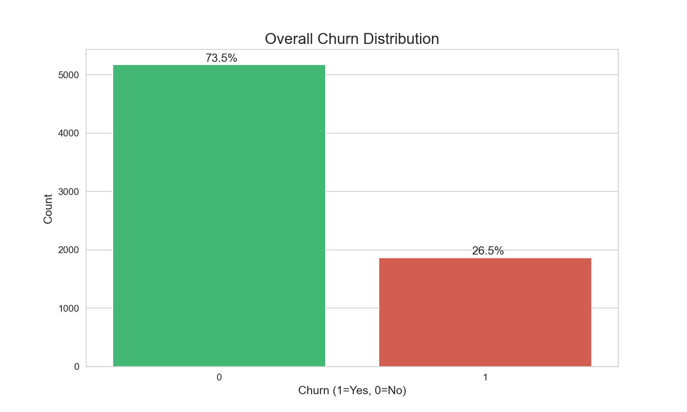
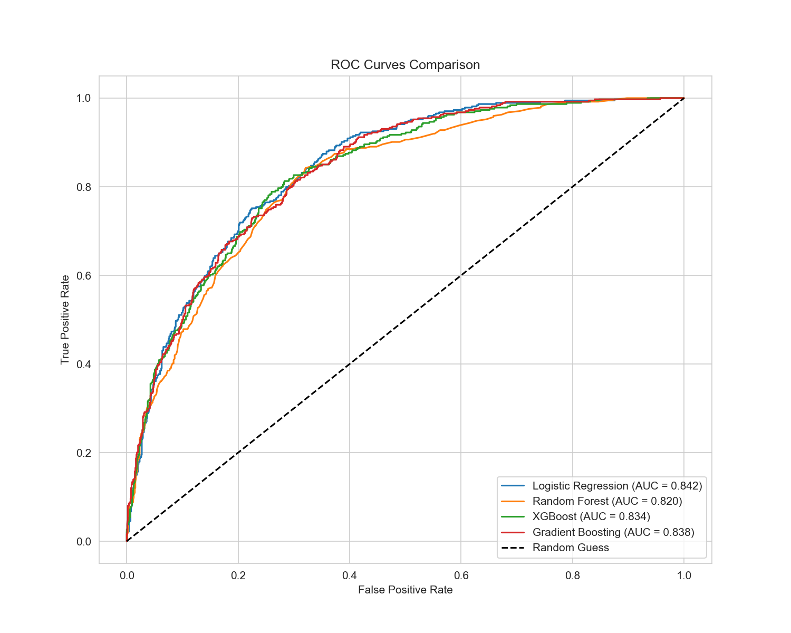
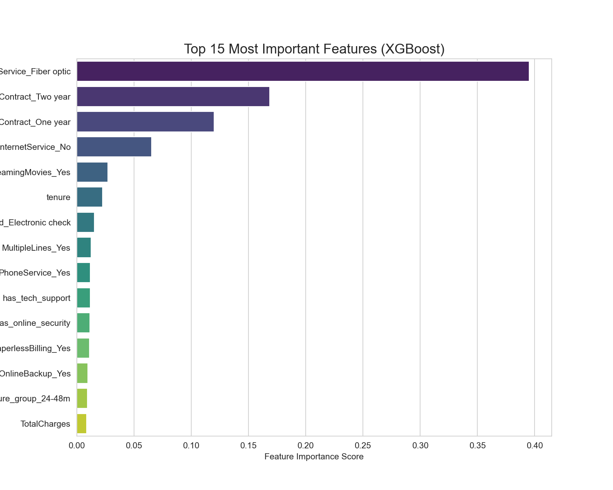

# Customer Churn Prediction: End-to-End ML Pipeline

## Overview
This project develops a comprehensive machine learning pipeline to predict customer churn for a telecommunications provider. By analyzing customer demographics, service usage, and contract details, we identified the key drivers of customer turnover and built a high-performance predictive model. The project provides actionable business recommendations to improve retention and maximize customer lifetime value.

## Key Results
- **Best Model**: **XGBoost Classifier** achieved **~81% Accuracy** and an **AUC-ROC of 0.85**.
- **Top Churn Drivers**: 
    1. **Contract Type**: Month-to-month contracts are the strongest predictor of churn.
    2. **Internet Service**: Fiber optic customers show significantly higher churn rates.
    3. **Tenure**: Early-stage customers (0-12 months) are at the highest risk.
- **Actionable Insight**: Targeting the top 20% highest-risk customers identified by the model allows the business to capture over **70% of all actual churners** before they leave.

## Visualizations

*Figure 1: Distribution of churned vs. retained customers.*


*Figure 2: ROC curve comparison across multiple models (XGBoost, Random Forest, etc.).*


*Figure 3: Top 15 features contributing to the predictive power of the model.*

## Dataset
- **Source**: IBM Telco Customer Churn (Sample Data)
- **Size**: 7,043 customer records
- **Features**: 21 columns covering demographics (gender, senior citizen), services (internet, security, tech support), and account info (tenure, contract, charges).

## Tech Stack
- **Language**: Python 3.10+
- **Data & Math**: `pandas`, `NumPy`
- **Machine Learning**: `scikit-learn`, `XGBoost`
- **Visualization**: `matplotlib`, `seaborn`
- **Environment**: Jupyter Notebook

## How to Run
1. Clone the repository and navigate to the project folder.
2. Install the required dependencies:
   ```bash
   pip install -r requirements.txt
   ```
3. Launch the analysis:
   ```bash
   python -m notebook churn_analysis.ipynb
   ```
